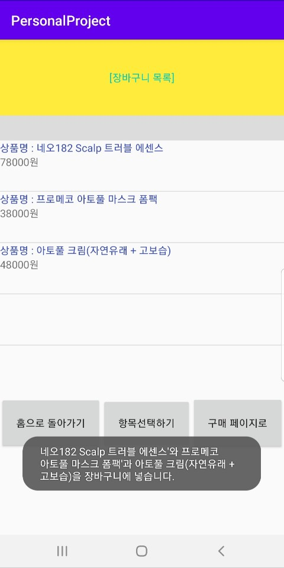
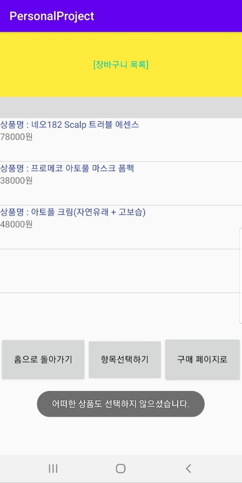
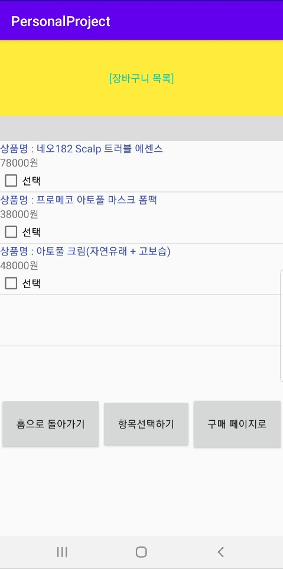
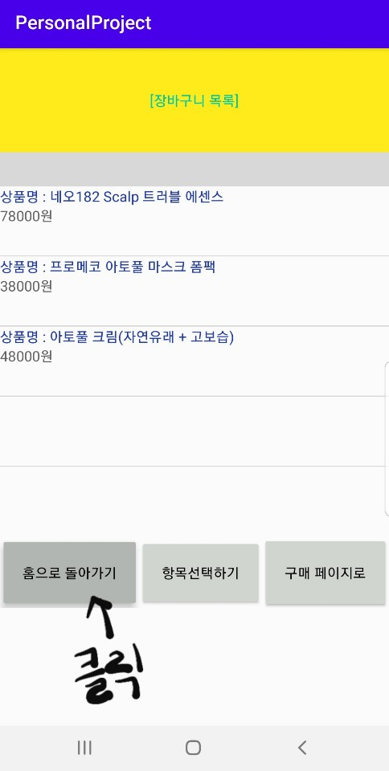
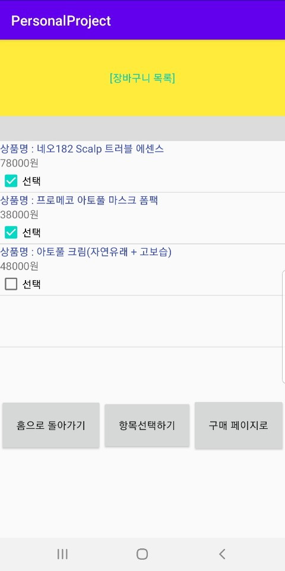

# Botanic Space Application
project for Mobile Programming  
- email address : hockey9322@kookmin.ac.kr  
- 이름 : 김정엽  
- 학과 : 소프트웨어학과  
- 학번 : 20171601  

## 과제 목표
1.첫번째 화면 (Relative Layout 혹은 Fragment 사용)
- 상품 선택 페이지
- 상품은 2개이상 화면에 출력. 각 상품의 제품명, 가격 정보 표시
- 상품 선택하면 아래에 버튼으로 구매 혹은 장바구니 선택
- 장바구니 버튼을 클릭시에는 두번째 화면으로 이동
- 구매 버튼을 클릭시에는 세번째 화면으로 이동

2.두번째 화면 (Linear Layout 혹은 Fragment 사용)
- 장바구니 페이지
- 장바구니에 추가한 상품명, 가격 정보 출력
- 구매 버튼과 홈버튼을 출럭
- 홈버튼을 클릭하면 첫번째 페이지로 이동
- 상품별로 선택(Radio 버튼, 체크 박스 활용) 여부 체크후에
  구매 버튼을 클릭하면 세번째 페이지로 이동

3.세번째 화면 (Table Layout, Grid Layout 중 하나 사용)
- 구매 페이지
- 선택한 제품명, 가격 정보를 출력
- 선택한 제품이 여러개면 결재할 총합 선택
- 주소정보, 연락처 입력
- 구매 완료시에 첫번째 화면으로 이동

 각페이지 구성시에 View을 상속한 여러가지 위젯을 사용하여 화면을 구성(기능에 맞는 위젯 선택하여 구성) 
ListView, GridView, AdapterView, ToolBar, Text View, CheckBox, Switch,
ToggleButton, RadioButton, ImageView, ImageButton 등

## 개발환경(Development Environment)
- Android Studio @3.10
- AVD 가 구동이 안되어 , 실제 단말기(Galaxy Note8)를 연결하여 구현

## 과제 구현 동기
- 저의 어머니가 직접 운영하시는 네이버 스마트 스토어(상호명: 보타닉스페이스)에 파는 상품들을 이번 과제 내용에 적용하였습니다. 
 - 참고 사이트: https://smartstore.naver.com/botanikspace?NaPm=ct%3Dkgcecmxh%7Cci%3Dcheckout%7Ctr%3Dds%7Ctrx%3D%7Chk%3D12be37c1d9766b16a3f4024a009621a2b0699867

## 과제 구현 내용
1.첫번째 화면 (Relative Layout 사용)
- 상품 선택 페이지(5개 항목)
- 각 상품들의 제품명, 가격 정보 표시가 화면에 나타나 있음
- 상품 이미지를 선택하면 각 상품에 대한 체크박스 생성
---(다시 이미를 선택하면, 체크박스 사라짐)
- 상품에 대한 체크박스에 체크하고 아래에 있는 장바구니 버튼 선택시, 두번째 화면(구매 페이지)으로 이동
- 상품에 대한 체크박스에 체크하고 아래에 있는 구매버튼 선택시, 세번째 화면(구매 페이지)으로 이동
- 체크박스에 아무런 체크를 하지 않고 '장바구니페이지'와 '구매페이지'로 가려고 할 경우  
---장바구니에 상품을 담으라고 Toast message 출력

2.두번째 화면 (Linear Layout 사용)
- 장바구니 페이지
- 장바구니에 추가한 상품명, 가격 정보 출력
- (장바구니 페이지로 넘어오면서 장바구니에 담은 상품에 대한 Toast message 도 출력)
- '홈으로 돌아가기' 버튼을 클릭하면 첫번째 페이지로 이동
- '항목 선택하기'버튼을 클릭하면 각 상품별로 체크박스 생성
- 체크박스 선택 여부에 따른 정보를 가지고 '구매 페이지로'버튼을 클릭하면 세번째 페이지로 이동
- 장바구니에 담긴 상품에 대한 체크박스에 아무런 체크를 하지 않았다면, 아무런 상품을 담지 않았다는 message 출력

3.세번째 화면 (Table Layout, Grid Layout 사용)
- 구매 페이지
- 선택한 제품마다 제품명, 가격 정보가 출력
- 주소정보, 연락처를 입력하는 동적 text란 생성
- 선택한 제품에 따른 가격 정보 총합이 계산되어 출력
- 'URL' 버튼을 클릭시, '보타닉스페이스' 사이트로 이동
- '결제' 버튼을 클릭시, '구매 완료를 하였다'는 message 와 함께 첫번째 페이지로 이동

## 화면마다 사용한 레이아웃,위젯
1. 첫번째 페이지
> * RelativeLayout
    - textView
    - ScrollView
        - LinearLayout
          - RelativeLayout
            - textView,ImageView,CheckBox
          - RelativeLayout
            - textView,ImageView,CheckBox
          - RelativeLayout
            - textView,ImageView,CheckBox
          - RelativeLayout
            - textView,ImageView,CheckBox
          - RelativeLayout
            - textView,ImageView,CheckBox
    - Button
    - Button

2. 두번째 페이지
> * LinearLayout(vertical)
    - textView
      - (divider1
      - textView
      - textView
      - CheckBox) x 5
      - ...
  - LinearLayout(horizontal)
    - Button
    - Button
    - Button

3. 세번째 페이지
> * LinearLayout(vertical)
   - textView
    * ConstraintLayout
      - ScrollView
        - GridLayout
          - textView
          - EditText
          - ImageView
          - textView
          - EditText
          - Button
          - Button
    - divider
    * ConstraintLayout
      - TableLayout
        - TableRow
          - textView X 2
        - TableRow
          - textView X 2
        - ...

## 실행화면

> 1. 어플을 실행하면 나오는 첫번째 페이지

> 2. 스크롤을 내리면 밑에 있는 상품도 확인할 수 있습니다.  
(총 5개의 상품이 보여집니다.)

> 3. 각 상품의 이미지를 클릭하면 상품을 선택할 수 있도록 체크박스가 보여집니다. 
(다시 누르면 체크박스는 사라집니다.)

> 4. 어떠한 상품도 선택하지 않고 '장바구니 페이지로'버튼을 클릭한다면, 장바구니에 상품을 담아달라는 메시지를 출력합니다.

> 5. 어떠한 상품도 선택하지 않고 '바로구매' 버튼을 클릭한다면,   어떠한 상품도 선책하지 않았다는 메시지를 출력합니다.

> 6. 3가지 상품을 선택하고 '장바구니 페에지로' 버튼을 눌렀다고 하면,  두번째 페이지인 장바구니 페이지로 이동합니다. 
(선택한 상품이 장바구니에 담겼다는 메시지도 함께 출력합니다.)

> 7. 장바구니에 담긴 상품에서 항목을 선택하지 않고 바로 '구메페이지로' 버튼을 누른다면  어떠한 상품도 선택하지 않았다는 메시지를 출력합니다.

> 8. '항목선택하기' 버튼을 클릭하면, 장바구니에 단긴 상품들 중  구매하고 싶은 상품을 선택할 수 있도록 체크박스가 보여집니다.

> 9. 이 떄 첫번째 페이지로 돌아가고 싶다면 '홈으로 돌아가기' 버튼을 클릭하면 됩니다.

> 9. 두번째 페이지에서 원하는 상품을 선택하고  구메페이지를 누르면, 세번째 페이지인 구메페이지로 이동합니다. 

> 10. 세번째 페이지인 구메페이지로 올 때, 구매목록에 담긴 '상품명'이 메시지로 출력됩니다. 
각 상품들의 '상품명'과 '가격'이 출력되며, 구매하려는 상품의 총 결제금액 또한 출력됩니다.

> 11. 연락처와 주소를 입력할 수 있는 동적 텍스트뷰가 보여지고   주소를 입력할 때 '결제'버튼이 밑으로 내려져 가는 현상은   스크롤바를 올림으로써 해결할 수 있습니다.

> 12. 'URl' 버튼을 클릭하면 '보타닉스페이스' 네이버스토어로 바로 연결되는 기능을 추가하였습니다.

> 13. '결제'버튼을 클릭하면 구매가 완료되었다는 메시지와 함께 다시 첫번째 화면으로 돌아옵니다.

