# Pet World Application
TeamProject for Mobile Programming  

- TeamName : 팀10
- Team Member : 김정엽, 노지민, 강다윤
- email address : hockey9322@kookmin.ac.kr  
- 이름 : 김정엽  
- 학과 : 소프트웨어학과  
- 학번 : 20171601  

## 과제 목표
  1. 회원 가입 기능
- 반려동물 사진 필수로 첨부
- 거주위치 필수 입력(지하철역 옵션)
- 반려동물 이름 , 종 이름 입력
- 종 크기 선택 (ex. 대형견, 중형견, 소형견)  
 
  2. 아이디,비밀번호 찾기 기능
- 자신의 아이디와 비밀번호를 잊어버렸을 경우 찾을 수 있다. 
 
  3. 만날 기준 선택
- <b>종 크기(size) 중심</b> : 회원가입시 기입했던 거주위치 주변의 반려견들과 매칭  
    - <b>선택 위치 중심(지하철역 기준)</b> : 따로 원하는 지역이 있으면 선택 가능 
     
  4. 친구 리스트 출력/ 친구 신청 기능
- 사용자 주변의 해당 반려동물 프로필 리스트가 뜬다 -> 친구 신청 
 
  5. 채팅 기능 활성화
- 친구 신청을 받은 사용자도 친구신청을 했던 사용자에게 친구 신청을 한다면, 채팅이 활성화된다. 

 각페이지 구성시에 View을 상속한 여러가지 위젯을 사용하여 화면을 구성(기능에 맞는 위젯 선택하여 구성) 
ListView, AdapterView, ToolBar, Text View, CheckBox, ImageView, ImageButton 등

## 개발환경(Development Environment)
- Android Studio @3.10
- Firebase Database
- AVD 가 구동이 안되어 , 실제 단말기(Galaxy Note8)를 연결하여 구현

## 과제 구현 동기
 - 코로나가 장기화 됨에 따라 사람들에게 코로나블루가 심화되고 있다.
 - 사람들 뿐만 아니라 반려견들에게도 친구를 만들어 주면 어떨까 싶어서 어플을 계획하게 되었다.
 - 기대 효과
  - 1) 사회성이 부족한 반려견들에게 친구를 만들어줌으로써 사회성을 길러줄 수 있다.
  - 2) 원하는 지역에서 반려동물들은 친구를 사귈 수 있다.

## 과제 구현 내용
1) MainActivity (LinearLayout 사용) : 홈 화면 
- 로그인 화면
- 아이디 EditText 란에 아이디 입력
- 비밀번호 EditText 란에 비밀번호 입력
- 로그인 Button 을 누르면 ThirdActivity 로 이동
- 회원가입 TextView 를 누르면 SecondActivity 로 이동
- 아이디,비밀번호 찾기 TextView 를 누르면 SearchActivity 로 이동
- 아이디와 비밀번호 입력 란에 Firebase Database 에 저장이 안된 회원정보 입력후 로그인 버튼 선택 시 , 제대로 확인하라는 Toast message 출력

2) SecondActivity (Linear Layout, ScrollView 사용) : 회원가입 화면  
- 회원가입 화면
- [아이디, 비밀번호, 비밀번호 확인, 반려견 이름, 반려견 종류, 반려견 크기(Spinner 선택), 거주지 입력, 사진 첨부] 등의 모든 회원가입시 필요한 정보들을 조건에 맞게 제대로 입력했을 때만, 회원가입이 완료되도록 해준다.  
- 이용약관과 개인정보 정책을 확인하지 않고 이용약관에 동의한다는 체크박스를 선택 시, 해당 내용을 확인하라는 Toast message 출력과 함께 체크가 안되도록 설정(이용약관과 개인정보 정책을 확인했다면 강제로 체크박스 선택됨)
- 이용약관은 PopupActivity_1 에 해당
- 개인정보 정책은 PopupActivity_2 에 해당
- 아이디 중복 검사 시 , Firebase Database 에 해당 아이디가 있다면 이미 존재하는 아이디라는 Toast message 와 함께 회원가입을 할 수 없다.
- 사진을 내장 갤러리에서 불러올 때, 사진 잘림현상, 회전현상 해결

3) SearchActivity (Linear Layout) : 아이디,비밀번호 찾기 화면
- 아이디,비밀번호 찾기 화면
- 아이디 찾기에서는 회원가입시 입력했던 반려견 이름과 거주지를 입력하면 찾을 수 있다.
- 비밀번호 찾기에서는 회원가입시 입력했던 반려견 이름과 거주지(지하철역)와 아이디를 입력하면 찾을 수 있다.
- 입력했던 정보가 Firebase Database 에 저장이 안된 회원, 즉 잘못된 정보라면 입력한 정보가 존재하지 않다고 Toast message를 출력한다.

4) ThirdActivity (Linear Layout) : 친구를 만날 기준 선택하는 화면
- 견종 사이즈 기준으로 친구 리스트 보기
  - Spinner 에 [대형견,중형견,소형견] 중에 선택 후 GO 버튼 클릭 시 , FourthActivity 로 이동
- 동네별(지하철역) 기준으로 친구 리스트 보기
  - GO 버튼 클릭 시, FifthActivity 로 이동
- 로그 아웃 버튼 클릭 시, 로그아웃 팝업 생성
  - 취소 클릭 시, 현재 페이지 계속 유지
  - 로그 아웃 클릭 시, 홈 화면으로 이동
- 나의 친구목록 버튼 클릭 시 SevenActivity 로 이동
  - 서로 친구가 되어 있다면 대화방 리스트 출력
  - 친구가 아직 없다면, 서로 친구 신청이 된 상태에서 대화를 할 수 있다는 Toast mseeage 출력

5) FourthActivity (Linear Layout-ListView) :  견종 사이즈 기준 회원 리스트
- ThirdActivity 에서 Spinner 로 선택한 값을 받아와 Database 에 저장된 size 와 비교해 같으면 그에 맞는 회원정보를 출력해준다.
- 회원 리스트에 출력된 회원에게 친구신청을 누르면 친구신청을 하였다는 Toast message 출력
- 상대방이 나에게 친구신청을 하면 서로 친구가 될 수 있다.

6 ) FifthActivity (List Layout-ListView) :  동네별(지하철역) 을 검색할 수 있는 리스트
- ThirdActivity 에서 GO 버튼을 클릭하면 서울에 있는 모든 지하철 역을 검색툴바로 검색할 수 있는 리스트를 출력한다.
- 검색을 해서 원하는 지하철역을 선택하면 SixthActivity 로 이동

7) SixthActivity (Linear Layout-ListView) :  선택한 지하철 역 기준 회원 리스트
- FifthActivity 에서 선택된 지하철역 값과 Adapter에 해당 User 프로필 add.Database 에 저장된 지하철역과 비교해 같으면 그에 맞는 회원정보를 출력해준다.
- 회원 리스트에 출력된 회원에게 친구신청을 누르면 친구 신청이 상대방에게 전해진다.

8) SevenActivity (Linear Layout-ListView) : 친구리스트 출력
- 대화하기 버튼 클릭 시 , EightActivity로 이동
 - 해당 친구와 대화방이 형성된다.
 - 대화목록은 저장되어 있다.

9) SevenActivity (Linear Layout-ListView) : 친구와의 대화방 출력
- 해당 친구와 대화를 할 수 있다.
- 대화목록은 저장되어 있다.
- 대화를 진행하면 List가 자동으로 스크롤이 되어 대화가 Update 된다.

10) 그 외 Class 들
  - ChatData.class
  - Information.class
  - ListViewAdapter.class
  - ListViewItem.Class
  - MessageAdapter.Class
  - MsgAdapter.class
  - PopupActivity_1.Class
  - PopupActivity_2.Class
  - SearchActivity.Class

11) 그 외 txt 파일 과 value들
 - subway.txt
 - text_1.txt
 - text_2.txt
 - categorty.xml
 - colors.xml
 - strings.xml
 - styles.xml

## 주요 기능 설명
- 전체적인 어플리케이션 개발에 있어서 팀원들과 모두 협업을 하였습니다.
- [주도적으로 구현했던 부분]
 > 전체적인 어플의 아이디어를 제공하였고, 전체적인 어플의 Flow와 디자인을 기획하였습니다.
 - MainActivity, SecondActivity, SearchActivity, ThirdActivity, PopupActivity_1, PopupActivity_2, FourtActivity, SixthActivity...

- [많은 기여를 했던 부분]
 > 그 외 많은 다양한 Class 생성
- 나머지 부분들은 팀원들이 주도적으로 구현하였고
세부적인 부분들은 zoom 회의와 직접 만나서 다 같이 협업을 하였습니다.

- 주요 기능들
  >
  >  - 회원가입 기능
  >  - 아이디, 비밀번호 찾기 기능
  >  -  로그인 기능
  >  - 선택 기준에 따른 회원 리스트 출력 기능
  >  - 친구리스트 출력 기능
  >  - 대화 기능

- 대표적인 기능 중 한 예)
  ~~~
  // 회원 가입 버튼 클릭 시 이벤트 처리
    Button JoinBtn = (Button) findViewById(R.id.Joinbtn);
      JoinBtn.setOnClickListener(new View.OnClickListener() {
        @Override
        public void onClick(View v) {
          ContentValues values;
          mEditId = (EditText) findViewById(R.id.InputId);
          mEditPw = (EditText) findViewById(R.id.InputPw);
          mEditPwCf = (EditText) findViewById(R.id.InputConfirmPw);
          mEditPetName = (EditText) findViewById(R.id.InputName);
          mEditSize = (Spinner) findViewById(R.id.InputSize);
          mEditKinds = (EditText) findViewById(R.id.InputKinds);
          mEditStation = (EditText) findViewById(R.id.InputSubway);

          String tid = mEditId.getText().toString();
          String tpw = mEditPw.getText().toString();
          String tpwcf = mEditPwCf.getText().toString();
          String tname = mEditPetName.getText().toString();
          String tkinds = mEditKinds.getText().toString();
          String tsize = mEditSize.getSelectedItem().toString();
          String tstation = mEditStation.getText().toString();

          boolean pwCheck =Pattern.matches("^(?=.*\\d)(?=.*[~`!@#$%^&*()-])(?=.*[a-zA-Z]).{6,16}$", tpw); /
                boolean stationcheck = false;  

                if(tstation.trim().length()!=0){
                    for(int i=0;i<subway.length;i++){
                        if(tstation.trim().equals(subway[i]+"역")) {
                          stationcheck = true;
                          break;
                          }
                      }
                        if(stationcheck == false) {
                            Toast.makeText(getApplicationContext(), "00역 입력조건으로 지켜주세요.", Toast.LENGTH_LONG).show();
                            return;
                        }
                }

                if(tid.trim().length() == 0 || tpw.trim().length() == 0 || tpwcf.trim().length() == 0 || tpw.trim().length() == 0 || tname.trim().length() == 0 || tkinds.trim().length() == 0 || tstation.trim().length()==0 ||imageCheck==false){
                    if((pwCheck==false && tpw.equals(tpwcf)==false)|| pwCheck==false && tpw.equals(tpwcf)==true){
                        Toast.makeText(getApplicationContext(),"8자 이상의 숫자와 영문,특수문자 조합을 지켜주세요.",Toast.LENGTH_LONG).show();
                        return;
                    }
                    else if(pwCheck==true && tpw.equals(tpwcf)==false){
                        Toast.makeText(getApplicationContext(),"비밀번호가 일치한지 제대로 확인해 주세요.",Toast.LENGTH_LONG).show();
                        return;
                    }
                    else if(pwCheck == true && tpw.equals(tpwcf)==true)
                        Toast.makeText(getApplicationContext(),"모든항목들을 조건에 맞춰서 모두 입력해주세요.",Toast.LENGTH_LONG).show();
                    return;
                }
                CheckBox inform_check = findViewById(R.id.inform_check); // 이용약관 및 정보 동의
                if(tid.trim().length() != 0 && tpw.trim().length() != 0 && tpwcf.trim().length() != 0 && tpw.trim().length() != 0 && tname.trim().length() != 0 && tkinds.trim().length() != 0 && tstation.trim().length()!=0 && imageCheck==true){
                    if(idcheck==false && inform_check.isChecked() == false){
                        Toast.makeText(getApplicationContext(),"아이디 중복검사를 해주세요.",Toast.LENGTH_LONG).show();
                        return;
                    }
                    else if(idcheck ==true && inform_check.isChecked() == false){
                        Toast.makeText(getApplicationContext(), "이용약관 및 사용자 정보제공 \n동의는 필수입니다!", Toast.LENGTH_SHORT).show();
                        return;
                    }
                    else if(idcheckagain==true){
                        if(inform_check.isChecked() == false){
                            Toast.makeText(getApplicationContext(), "이용약관 및 사용자 정보제공 \n동의는 필수입니다!", Toast.LENGTH_SHORT).show();
                            return;
                        }
                        else if(inform_check.isChecked() == true){
                            DatabaseReference user = mReference.child(tid);
                            user.child("id").setValue(tid);
                            user.child("pw").setValue(tpw);
                            user.child("name").setValue(tname);
                            user.child("size").setValue(tsize);
                            user.child("kinds").setValue(tkinds);
                            user.child("station").setValue(tstation);
                            Toast.makeText(getApplicationContext(), "회원가입을 축하드립니다.", Toast.LENGTH_SHORT).show();
                            Intent intent = new Intent(getApplicationContext(),MainActivity.class);
                            startActivity(intent); // 회원 가입 완료했으면 다시 홈화면으로 이동
                            return;
                        }
                    }
                }

                if(idcheck==false){
                    Toast.makeText(getApplicationContext(),"아이디 중복검사를 해주세요.",Toast.LENGTH_LONG).show();
                    return;
                }
                if(tid.trim().length() == 0 || idcheckagain==false){
                    Toast.makeText(getApplicationContext(), "아이디 중복검사를 다시 해주세요.", Toast.LENGTH_LONG).show();
                    return;
                }
                if(inform_check.isChecked() == false){
                    Toast.makeText(getApplicationContext(), "이용약관 및 사용자 정보제공 \n동의는 필수입니다!", Toast.LENGTH_SHORT).show();
                    return;
                }
                DatabaseReference user = mReference.child(tid);

                user.child("id").setValue(tid);
                user.child("pw").setValue(tpw);
                user.child("name").setValue(tname);
                user.child("size").setValue(tsize);
                user.child("kinds").setValue(tkinds);
                user.child("station").setValue(tstation);
                Toast.makeText(getApplicationContext(), "회원가입을 축하드립니다.", Toast.LENGTH_SHORT).show();
                Intent intent_home = new Intent(getApplicationContext(), MainActivity.class);
                startActivity(intent_home);
            }
        });
    }
~~~

## 특히 노력했던 점
 - 전체적으로 어플의 방향성과 구현을 주도했습니다.
 - 실행을 계속 해보면서 오류를 처리하는 것에 신경을 썼습니다.
 - 디자인 부분에 많은 신경을 썼습니다.
 - 전체적인 어플의 Flow를 기획했습니다.
 - 각 선택에 맞게 회원정보가 알맞게 나타날 수 있도록 했습니다.
 - 액티비티 전환과 Adapter를 이용한 리스트 출력과 대화 출력에 많은 노력과 시간을 썼습니다.

## 어려웠던 점
- 비대면이라 협업을 할 때 시간이 다소 오래 걸렸습니다.
- 직접 만나서 한 적이 있는데 서로 다 멀리 살아서 힘들었습니다.
- AVD 가 구동이 안되어서 단말기로 하느라 시간이 오래 걸렸습니다.
- 회원정보 정보가 많아 사진을 받아와서 보여주는 것에서 id값을 key값으로 설정한다면, 특정 기준으로 회원리스트를 선택했을 때 회원 정보에 맞는 사진을 올곧게 가져오지 못했었습니다.(생각해야 할 것이 복잡했습니다.)

## 실행화면

> 1. 어플을 실행하면 나오는 첫번째 페이지

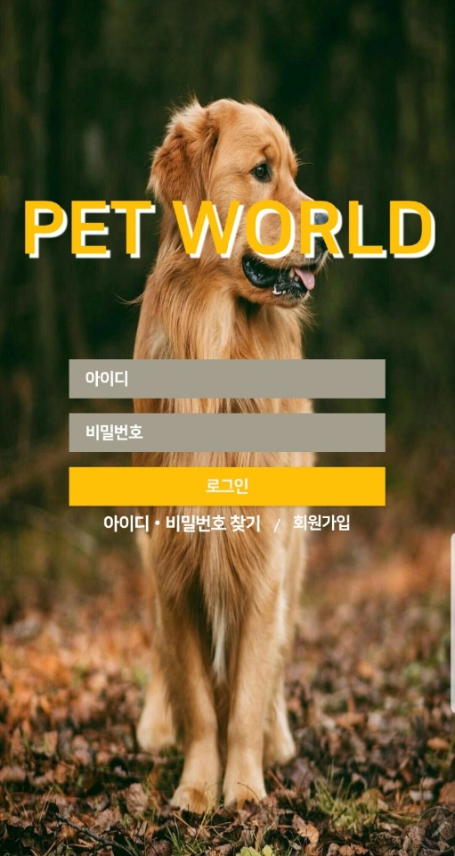

> 2. 회원가입 페이지   
(모든 입력조건에 대해 오류 처리 완료)

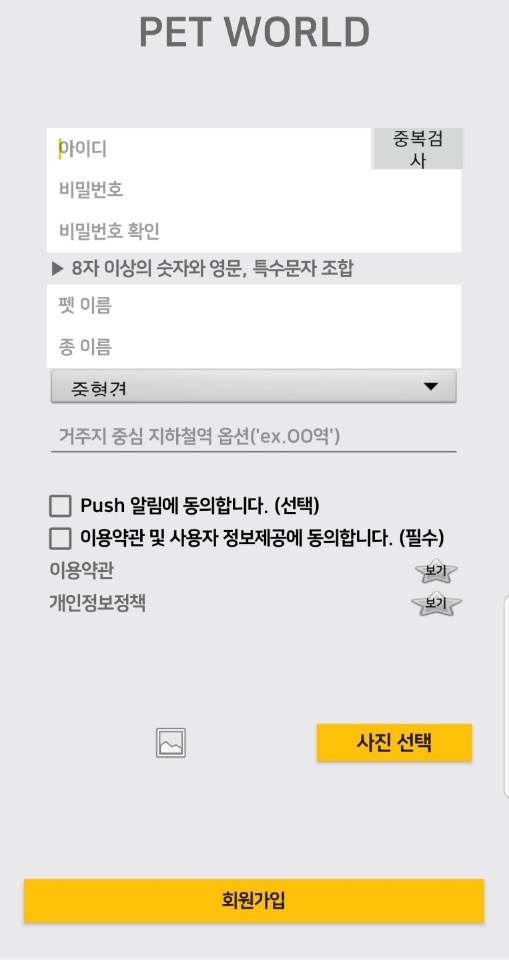

> 3. 이용약관 페이지
(반드시 확인하도록 설정 완료)

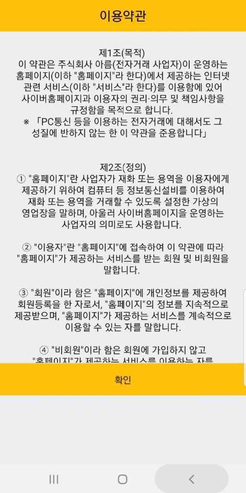

> 4. 개인정보 정책 페이지
(반드시 확인하도록 설정 완료)

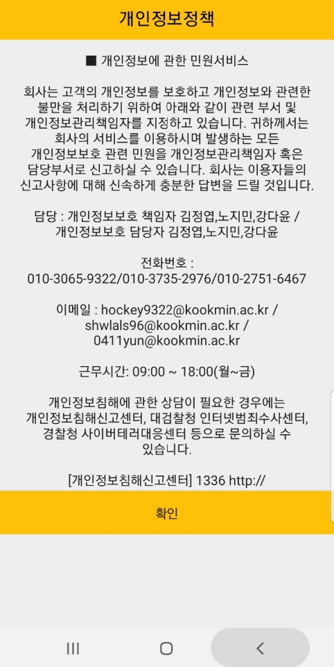

> 5. 회원가입 완료

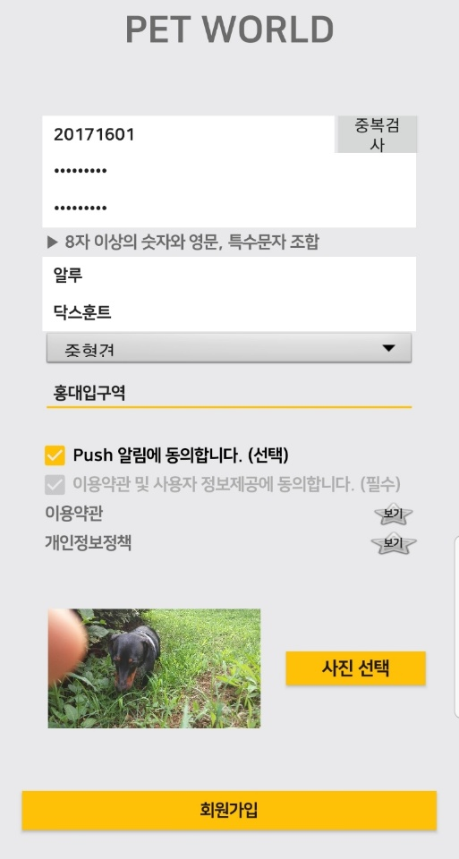

> 6. 아이디, 비밀번호 찾기 페이지

> 7.아이디 찾기 완료

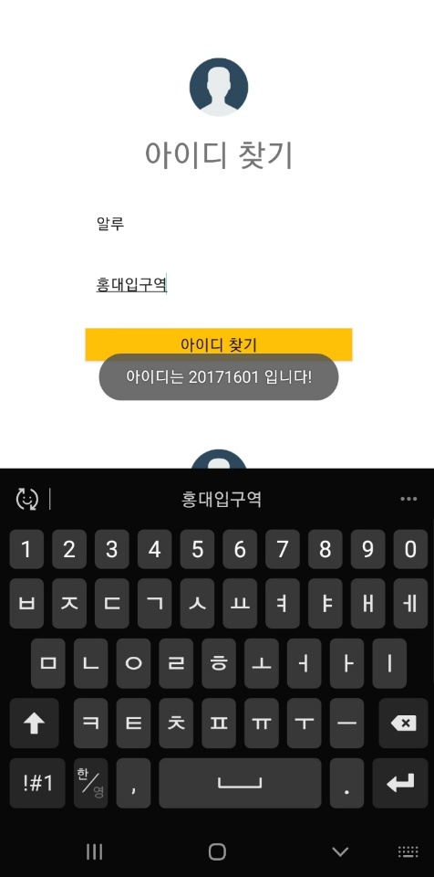

> 8.비밀번호 찾기 완료

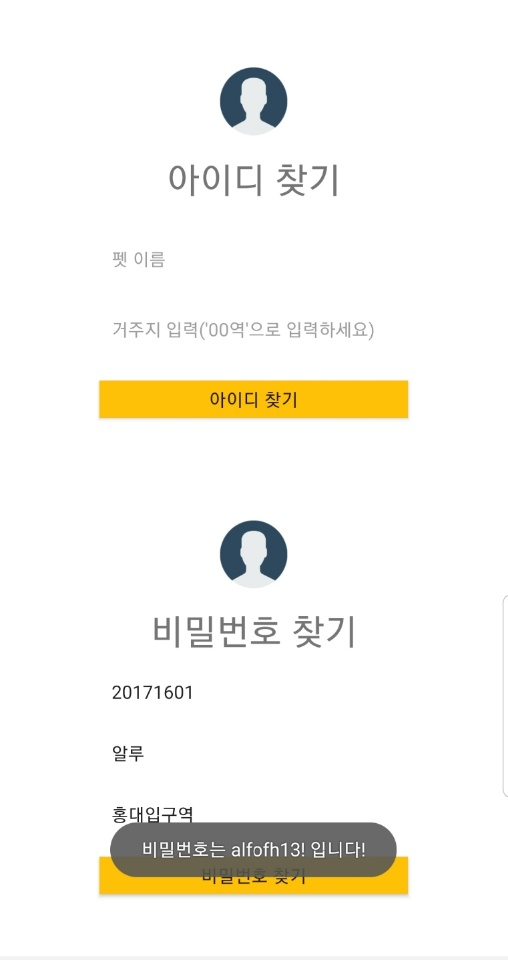

> 9. 로그인 틀렸을 시 나타나는 화면

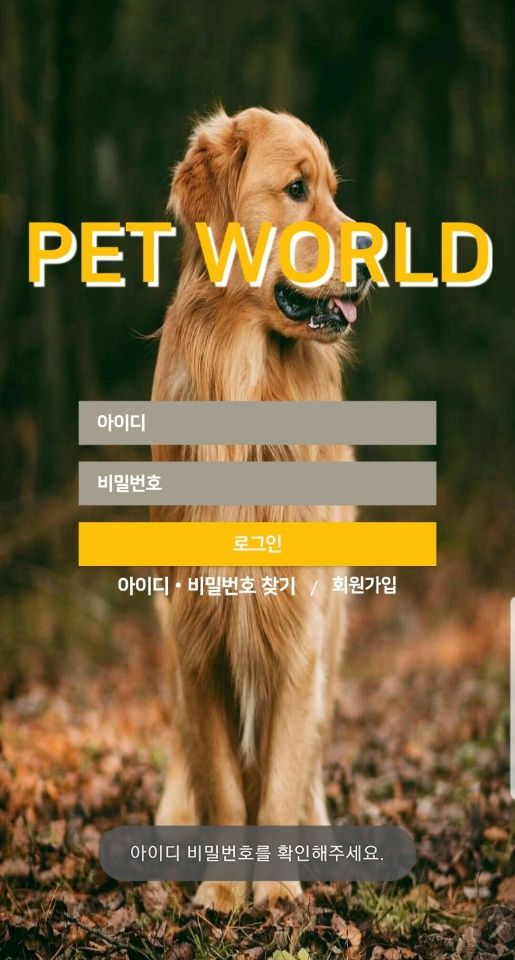

> 10. 로그인 성공 시 나타나는 ThirdActivity

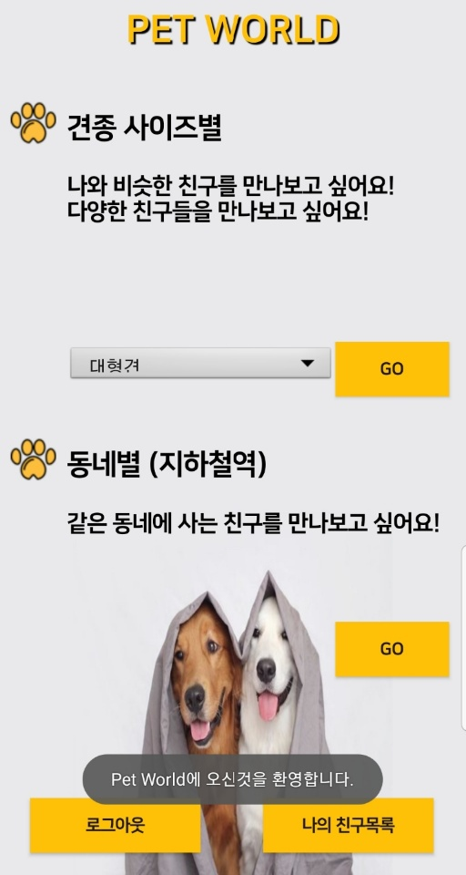

> 11. 원하는 반려견의 사이즈 선택을 Spinner로 할 수 있다.

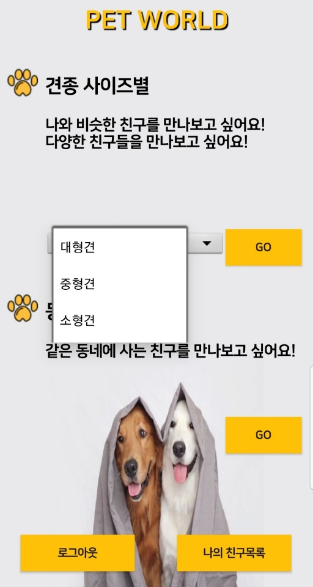

> 12. 로그아웃 버튼 클릭 시 나타나는 팝업

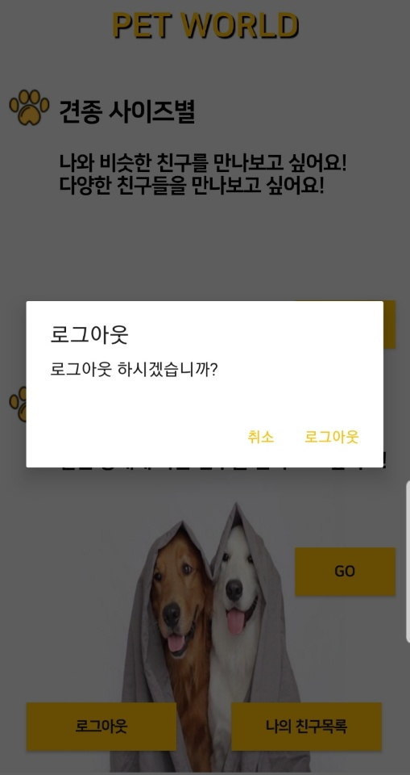

## 개발 날짜 기재

9/22 아이디어 회의(모두)

9/24 아이디어 선정 (김정엽)

9/25 시장조사 & 기능 초안 (모두)

11/2 Zoom 회의
      모프 개요 토의, blueprint 작성(김정엽)
11/6
- 전반적인 뼈대완성(로그인 페이지, 회원가입페이지) (노지민), (김정엽)
- 사진 회전현상 해결(김정엽)
- 회원가입 유효성검사 (노지민), (김정엽)
- Local DB에 저장 기능 구현 (노지민), (김정엽)

11/7
- Subway.csv -> text 파일로 바꾼 뒤 리스트뷰 생성 (강다윤)

11/12
대면 회의
- 어플 방향성 수정, 새로운 방향성 제시 (김정엽)
- 로그인 기능 구현(김정엽)
- firebase 리스트뷰를 이용(김정엽)
- firebase 연동 방법 연구 (모두)
- Station 리스트뷰에 메뉴 버튼에 지하철역 검색 기능 추가 구현 (강다윤)
Zoom 회의
- firebase에서 연동 기능 (노지민)

11/16
Zoom 회의
- 커스텀 리스트뷰 적용 방법 연구 (모두)
- firebase에서 데이터가져오기 (노지민)
- firebase에서 가져온 데이터 심플리스트에 추가하기 (노지민)
- 아이디 중복 기능 구현 (오류발생) 추후 삭제 (노지민)
- 로그인 기능 구현 (노지민),(김정엽)
- 아이디 중복 검사 기능 구현(김정엽)
- 아이디, 비밀번호 찾기 구현(김정엽)
- 기존 발견된 오류들 수정(김정엽)
- 저장한 데이터에서 id, pw, petname, size, kinds, station 따로 따로 가져오기 (강다윤)
- Information.java 파일 생성 (강다윤)
- FourthActivity 조금 수정 (강다윤)

11/17
- 이용약관, 개인정보 정책 팝업 완성(김정엽)
- 로그아웃 기능 구현(김정엽)
- 커스텀 리스트뷰 완성 (노지민)
- 선택별 회원정보 보기 기능 (노지민)
- 친구 추가기능 알고리즘 구현 (노지민)
- 친구 추가 기능 구현 (노지민)
- 친구목록 리스트 만들 때 체크박스 (강다윤) -> 데이터베이스 저장 문제로 다시 뺌
- 자신의 id 찾는 방법. 가져오는 방법 (강다윤)
- 친구목록 리스트 만들 때 체크박스 (강다윤) -> 데이터베이스 저장 문제로 다시 뺌

Zoom 회의
- 처음에 user child 하위에 friend child 생성 -> 문제 발생 -> user child 와 동등한 위치에 생성되도록 수정(강다윤)
- 친구목록 Activity 생성(강다윤)

11/18
카카오톡 연락 (개인 역할 분담)
- 대표 색깔 선정, UI 디자인 통일, background 이미지, icon 이미지, Font 적용 (강다윤)
- 채팅기능 구현 및 디자인(노지민)
- 채팅방 레이아웃 수정(김정엽)
- 그 전까지의 디자인 오류 수정(김정엽)
- 채팅방 디자인 외 어플의 전체적인 디자인 틀 수정(모두)

11/19

Zoom 회의
- 발바닥 아이콘 추가 (강다윤)
- 18일 UI 수정할 때 타이틀바 삭제 -> 문제 발생 -> 역 검색 메뉴 사라짐-> 검색 기능을 메뉴말고 바로 뷰에 보이도록 다시 구현 (강다윤)
- 액티비티 전환 간 오류 수정(김정엽)
- 채팅 시 자동 스크롤 기능 연구 (모두)
- 주석 정리 (모두)
- 어플 예외처리, 오류 잡기(로그아웃 기능) (모두)
- 최종오류체크 (모두)
